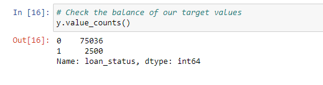

# Module 12 Report Template

# Classification Report 

## Overview of the Analysis

Lending institutions provide loans or assets to borrowers with the anticipation that the borrower will either return the asset or repay the loan. Credit Risk arises when a borrower fails to return the asset or fulfill the loan repayment, resulting in financial losses for the lender. Lenders assess this risk through various methods, but in this study, we will employ Machine Learning to examine a dataset of past lending transactions from a peer-to-peer lending platform. The objective is to develop a model that can assess the creditworthiness of borrowers.

I used a machine learning model to determine if loans are safe (low-risk) or risky (high-risk) based on the loan status provided by the lending company. 

After analyzing the lending company's dataset, I developed a Logistic Regression Model that achieved an impressive accuracy score of 99%. However, when it comes to distinguishing non-healthy loans, the model's recall value is lower (0.91) compared to its recall value for healthy loans (0.99). This suggests that the model performs better at predicting loan status as healthy rather than identifying loan status as non-healthy. The reason behind this discrepancy lies in the dataset's imbalance, where the majority of the data corresponds to one class label (in this case, healthy loans greatly outnumber non-healthy loans).

As seen below, the data is highly imbalanced.

